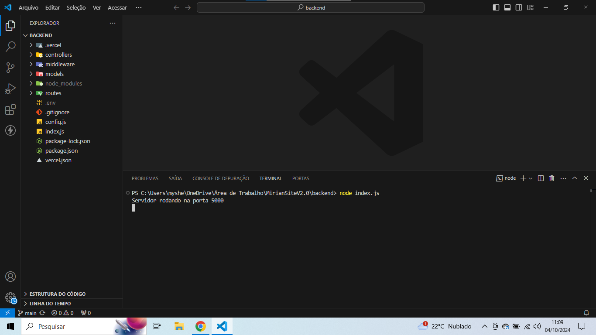
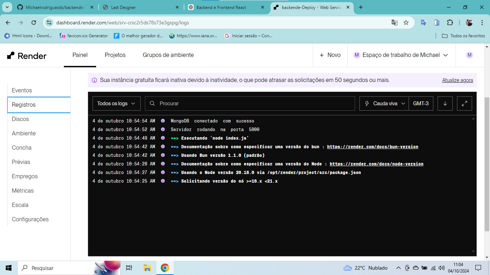

# 🛠️ Backend Deployment - Node.js API

## 📖 Descrição do Projeto

Este projeto consiste em uma API desenvolvida com **Node.js** e **MongoDB**, focada no gerenciamento de ofertas. O principal objetivo é permitir o gerenciamento de ofertas relâmpago,procedimentos e Mensagens. a conexão com um banco de dados MongoDB hospedado no **MongoDB Atlas** e a implantação do backend na plataforma **Render**.

---

## 🚀 Funcionalidades

- 🔒 **Gerenciamento de Ofertas**: CRUD (Criação, Leitura, Atualização e Exclusão) de ofertas relâmpago através da rota privada (Área Administrativa).
- 🛠️ **Gerenciamento de Procedimentos**: CRUD de Procedimentos (tabela de preços), acessível na Área Administrativa.
- 📨 **Gerenciamento de Mensagens**: CRUD de mensagens deixadas pelos usuários na rota pública, com a opção de o administrador aprovar mensagens antes que elas fiquem públicas.
- ⏳ **Temporizador de Ofertas**: Temporizador que exibe quanto tempo falta para as ofertas expirarem.
- 🔗 **Conexão Segura com MongoDB Atlas**: Integração robusta com o MongoDB online.
- 📦 **Deploy Automático**: Deploy contínuo configurado com o serviço Render, facilitando a hospedagem e atualização do projeto.

---

## 🔑 Variáveis de Ambiente

Para que o projeto funcione corretamente, você deve configurar as seguintes variáveis de ambiente:

- `MONGO_URI`: A string de conexão com o MongoDB Atlas.
- `PORT`: A porta na qual o servidor será iniciado (padrão 5000).

⚠️ **Dica**: Certifique-se de adicionar seu IP à lista de permissões no MongoDB Atlas para permitir conexões externas.

---

## 🏆 Desafios

Os principais desafios enfrentados durante o desenvolvimento do projeto foram:

- ⚙️ **Configuração do Banco de Dados**: Garantir que o MongoDB Atlas permitisse conexões do servidor online, incluindo a adição correta de IPs à lista de permissões.
- ⏱️ **Gerenciamento de Tempo Real**: Sincronizar o temporizador das ofertas sem a necessidade de recarregar a página.
- 🖥️ **Deploy na Render**: Superar problemas de permissões e configuração de variáveis de ambiente para garantir o funcionamento correto do backend em produção.

---

## 📸 Screenshots

### 🖥️ Rodando Localmente


### 🌐 Rodando Online


---
## 💻 Como Executar Localmente

1. Clone o repositório:
   ```bash
   git clone https://github.com/Michaelrodriguesds/backende-Deploy.git
Instale as dependências:

bash
Copiar código
cd backende-Deploy
npm install
Configure as variáveis de ambiente no arquivo .env:

bash
Copiar código
MONGO_URI=your_mongo_uri
PORT=5000
Inicie o servidor:

bash
Copiar código
npm start
O servidor estará rodando em http://localhost:5000.

-----------------//-------------------

🌍 Deploy Online
O backend está hospedado no Render

📂 Frontend
Para visualizar a aplicação frontend que consome essa API, acesse o repositório abaixo:

🔗 Frontend - Repositório GitHub codigo -- >   https://github.com/Michaelrodriguesds/miriandesignerepiladora?tab=readme-ov-file
Projeto  --> https://frontendweb-pqt2s8bpc-michaelrodriguesds-projects.vercel.app/


   
